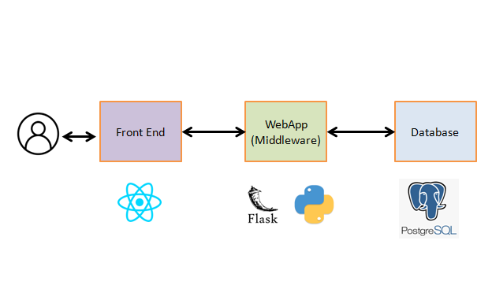
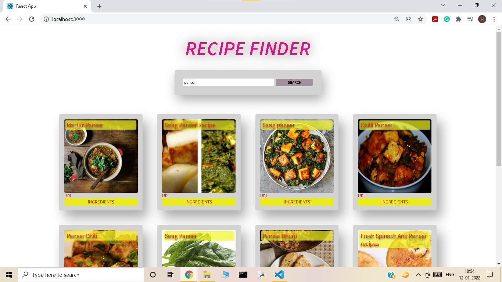

# recipefinder

This project is developed to build an application which will help users to finding recipe based on item search. User can enter an item in search box and upon successful search, UI will render results in format details as follows ; 
   * recipe name 
   * recipe image
   * recipe ingredients
   * recipe url (This redirects user to destination website which demonstrates in detail recipe steps to complete the delicious recipe) 

### Project Architecture Diagram 

### Project Description

As demonstrated in the block diagram, Project is divided into 3 parts mainly front end (ReactJS), Middleware(Rest service using Flask in Python) and database (Postgres)

### Project UI

You can enter your item in search box(For example. 'Paneer'), It will pass that term to backend service and backend service will query against the database and render the query output result in UI (Refer diagram)

### Run the project 

To run the Recipefinder UI, you need to run following commands

    ** npm install
    ** npm start (Runs the app in the development mode. Open http://localhost:3000 to view it in the browser.)

### Middleware service
Details about middleware service can be found here ;
https://github.com/Harshetamahajan/recipefinder_backend.git 

